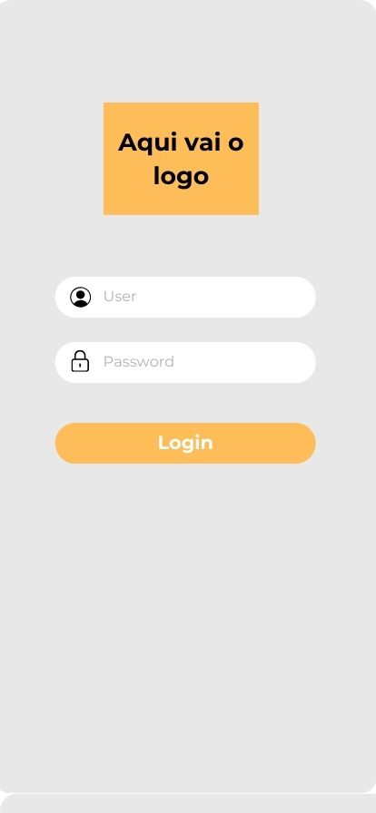
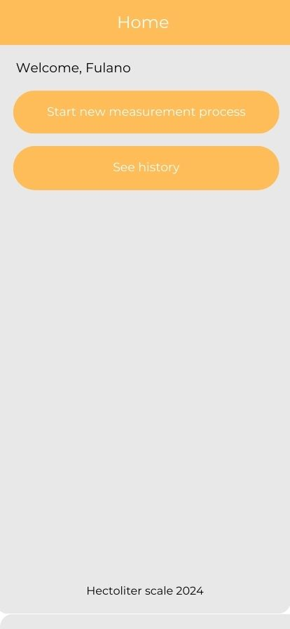
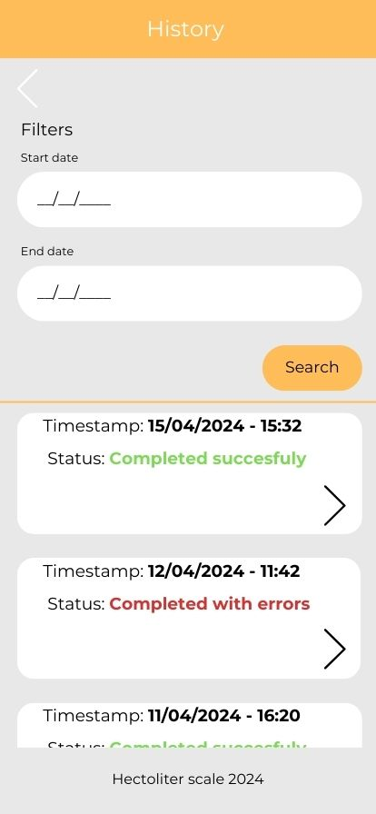
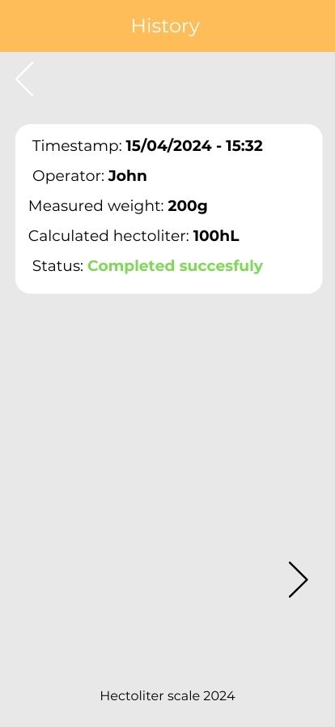
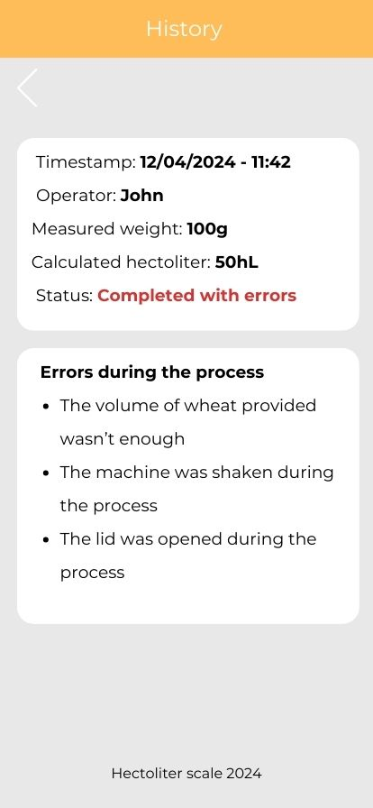
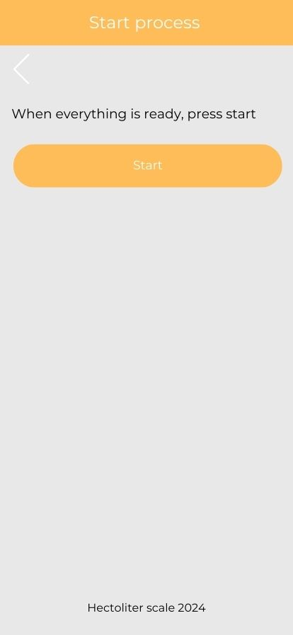
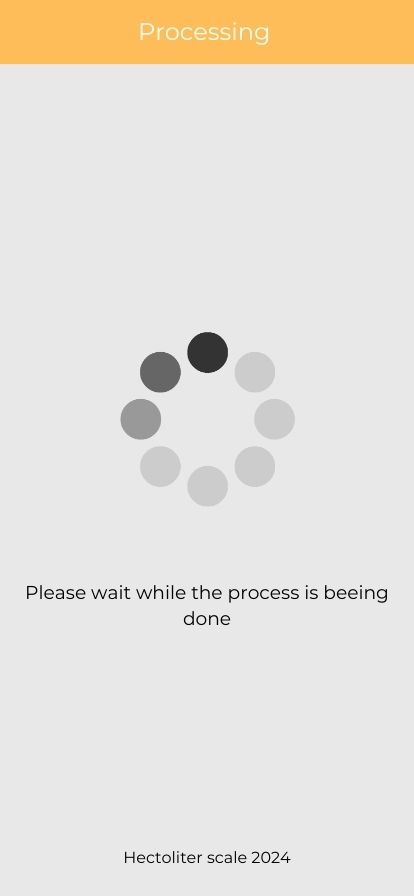
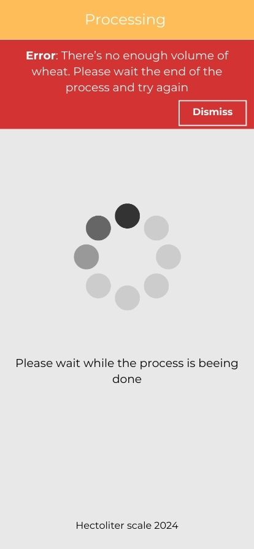
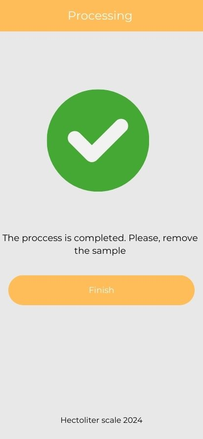
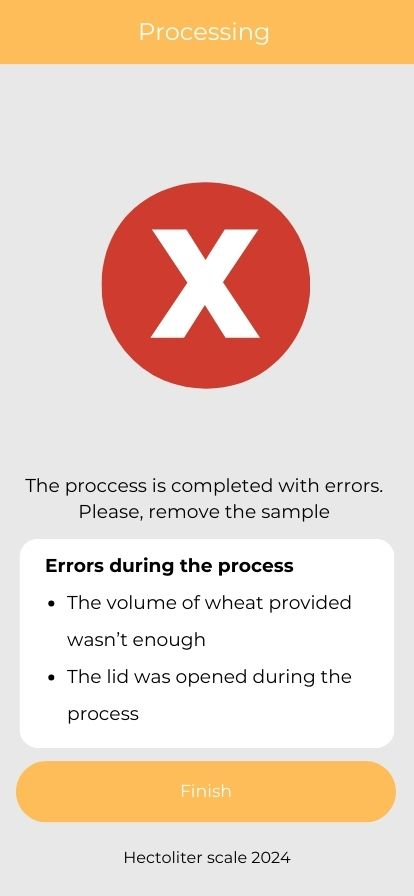

<h2>Software Documentation</h2>

<h2>Functional software requirements</h2>
<b>FR21.</b> The app must authenticate the user before letting them access the machine's information and function.   
<b>FR22.</b> The app should display a wait screen while the process is carried out.   
<b>FR23.</b> The app should display, at the end of the process, all information about the measurement.   
<b>FR24.</b> The app must have a button to request the start of a process.   
<b>FR25.</b> The app must have a history screen, that shows all previous measurement results.   
<b>FR26.</b> The app must allow the user to filter the history screen data by dates and display a list of measurements within that period.   
<b>FR27</b> The app’s start button must only work if the machine is available (has returned the measurement information from the previous request).   

<h2>Non-functional software requirements</h2>
<b>NFR13.</b>The app will be developed in Ionic framework.  
<b>NFR14.</b>The app will have an initial screen after logging in, to choose between the options of looking at the history and starting a new measurement process.  
<b>NFR15.</b>The database must be a SQL one.  
<b>NFR16.</b>The database must be accessible for the app and the machine via REST API.  
<b>NFR17.</b>The REST API must be developed in the Python language.  
<b>NFR18.</b>The database and API must be hosted in the cloud.  

<h2>UML diagrams</h2>

<h2><b>App</b></h2>

<b>Use Case</b>

    

 
<b>Activities</b>

    

 
<b>Screen Sequence</b>

    

<b>Sequence Diagram - Main</b>

    

  

<b>Sequence Diagram - History</b>

    

  
<b>App Screens - History</b>

    

    

    

    

    

    

    

    

    

    

<h3>Back</h3>

<b>Deploy</b>

    

 

<b>Relational</b>

    

 

<b>Seq Machine</b>

    

 

<h3>App Error Codes</h3>  
<b>10.</b> Servo Motor 1 is stuck  
<b>20.</b> Servo Motor 2 is stuck  
<b>30.</b> Stepper motor is stuck  
<b>40.</b> Return container has been removed  
<b>50.</b> The sample is not enough 
<b>60.</b> Collecting container was opened   
<b>70.</b> Connection error  
